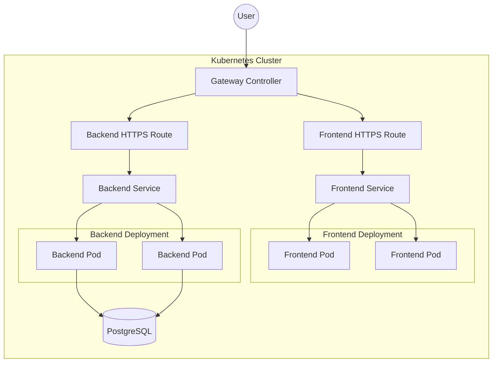

# Architecture

```mermaid
flowchart TB
    user(("User"))
    user --> gateway
    subgraph k8s ["Kubernetes Cluster"]
        gateway["Gateway Controller"]
    %% Frontend
        gateway --> frontendHTTPRoute
        frontendHTTPRoute["Frontend HTTPS Route"]
        frontendService["Frontend Service"]
        frontendHTTPRoute --> frontendService
        frontendService --> frontendPod1
        frontendService --> frontendPod2
        subgraph frontendDeployment["Frontend Deployment"]
            frontendPod1["Frontend Pod"]
            frontendPod2["Frontend Pod"]
        end
    %% Backend
        gateway --> backendHTTPRoute
        backendHTTPRoute["Backend HTTPS Route"]
        backendService["Backend Service"]
        backendHTTPRoute --> backendService
        backendService --> backendPod1
        backendService --> backendPod2
        subgraph backendDeployment["Backend Deployment"]
            backendPod1["Backend Pod"]
            backendPod2["Backend Pod"]
        end
    %% Database
        postgres[(PostgreSQL)]
        backendPod1 --> postgres
        backendPod2 --> postgres
    end
```

## Open questions

- [ ] Verify Neo4j session semantics (are nested calls to `Service.getNeo4jSession(...)` coordinating in a single
  transaction?)
